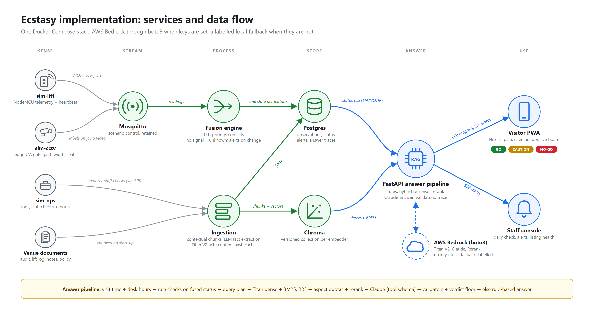

# Ecstasy: accessible until the last staircase

Ecstasy replaces a venue's static "wheelchair accessible" label with a route-level, time-aware, evidence-cited answer
to the question a visitor actually has: **"Can I get from arrival to my seat for *this* visit, with *my* needs?"**
It fuses live sensor and camera signals with maintenance logs, staff checks and visitor reports, and tells the venue
when its public listing has drifted from reality.



More: [solution proposal](docs/PROPOSAL.md), [anticipated questions](docs/QA.md), [demo script](docs/DEMO.md),
concept diagrams in [`docs/`](docs/).

## Problem statement

A venue's "wheelchair accessible" label is a static, binary promise about a dynamic, route-level reality. It says
nothing about which entrance is step-free, whether the lift is working today, what temporary obstacles exist, or
whether anyone will answer the gate at 18:30. Staff have no trigger to update it, so it decays silently. Visitors with
different needs (a wheelchair user; someone who walks short distances and needs seating) get the same one-word answer,
discover the truth at the last staircase, and pay for it in missed events and double transport costs.

**Focused question:** how can a visitor get an honest, personalised, current answer from a venue whose only published
fact is a two-year-old label, and how can the venue find out its listing is wrong *before* a visitor does?

## What it does

| Where | For | What happens |
|---|---|---|
| **Plan** | Visitors | Pick the event, mobility and needs, ask in your own words (or by voice). Progress streams live. |
| **Answer** | Visitors | GO / CAUTION / NO-GO, a cited step-by-step route, warnings with ages, a "before you travel" checklist with tap-to-call numbers, and where the listing is wrong. A banner appears if live status on your route changes. |
| **Live** | Everyone | The fused status of every feature: source, confidence, age. Updates over server-sent events. |
| **Report** | Visitors, staff | Free text in; dated facts extracted per feature and shown back within seconds. |
| **Daily check** | Staff | One tap per feature. Human checks expire, so they cannot go stale silently. |
| **Alerts** | Staff | Raised on transitions: a feature becomes blocking, sources disagree, a sensor goes silent, recovery. |
| **Listing health** | Staff | Each public claim graded against live evidence, events at risk, a drafted honest listing. |
| **Demo console** | Presenters | Drive the simulated lift, cameras and operations team through eight scenarios over MQTT. |

## Architecture

One Docker Compose stack (`infra/docker-compose.yml`):

| Service | Role |
|---|---|
| `sim-lift` | Simulated NodeMCU on the lift controller: position, doors, fault codes, heartbeat over MQTT. |
| `sim-cctv` | Simulated edge computer vision: gate state and waiting time, courtyard path width, free foyer seats. Labels only. |
| `sim-ops` | Simulated operations team: maintenance log entries, staff checks and visitor reports posted to the API. |
| `mosquitto` | MQTT broker; the scenario control topic is retained. |
| `worker` | Translates readings to observations; deterministic fusion engine (TTL, priority, conflicts, alerts); ingestion (contextual chunks, Titan V2 embeddings with a content-hash cache, LLM fact extraction from reports). |
| `postgres` | Observations, fused status, alerts, reports, embedding cache, answer traces; LISTEN/NOTIFY for live events. |
| `chroma` | Vector store, one collection per embedding version. |
| `api` | FastAPI: the answer pipeline, SSE streams, reports, staff checks, listing health, scenario control. |
| `web` | Next.js + Tailwind PWA (mobile first, installable, offline shell). |

### The answer pipeline

1. **Visit context**: visit time against assistance desk hours and the pre-booking window (venue time zone).
2. **Rule checks** on fused status: which features this visitor needs, and which statuses block or caution them.
3. **Query plan**: the fast model (gpt-oss-20b on Groq, or Claude Haiku on Bedrock) proposes sub-queries; the rule plan is always merged in. Rule findings sharpen the
   search (an after-hours visit searches the after-hours policy; a lift fault adds the sensor's note).
4. **Hybrid retrieval**: dense embeddings (Groq nomic-embed-text or Titan V2) in Chroma plus BM25, fused with Reciprocal Rank Fusion. Documents
   dated after "now" are hidden; repeated identical entries collapse.
5. **Aspect quotas + rerank**: the question and each at-risk feature get their own best evidence; remaining slots by
   Bedrock Rerank (or RRF offline) x recency x trust; every required feature covered.
6. **Generation**: gpt-oss-120b on Groq (or Claude Sonnet via Bedrock Converse) with a forced tool schema; live status items (S1..) and
   passages (P1..) are numbered, and every route step must cite one.
7. **Validators**: schema, citations exist, steps cited, no carry/lift-the-person advice, no stairs for wheelchair
   users. One repair attempt, otherwise the rule-based composer answers.
8. **Safety floor**: the verdict can never be more optimistic than the rules allow; verify items are added for
   uncertain features. Every answer is stored as a trace (queries, passages, scores, prompt version, latency).

Live sensor data is never embedded: it goes through fusion and reaches the model as structured, dated items.

## Run it

Requirements: Docker Desktop (or Docker Engine with Compose v2).

```powershell
copy .env.example .env        # optional: add GROQ_API_KEY (or AWS credentials for Bedrock)
docker compose -f infra/docker-compose.yml up --build
```

- Web app: http://localhost:3000 (on a phone on the same network: `http://<your-PC-IP>:3000`)
- API docs: http://localhost:8000/docs
- Chroma: http://localhost:8001, MQTT: localhost:1883, Postgres: localhost:5432 (nimbus / nimbus)

On first start the worker seeds the venue, fuses its history and indexes the documents; the simulators start
publishing straight away. Stop with `Ctrl+C`; `docker compose -f infra/docker-compose.yml down -v` also wipes data.

### AI provider

Ecstasy runs on either Groq or AWS Bedrock. `NIMBUS_LLM_PROVIDER=auto` picks Groq when `GROQ_API_KEY` is set, otherwise
Bedrock when AWS credentials are set, otherwise the local fallback. Keys come from the environment, which Compose fills
from `.env` (gitignored). Never commit keys.

#### Groq (free tier)

Create a key at [console.groq.com](https://console.groq.com) under API Keys and put it in `.env` as `GROQ_API_KEY`.
Groq calls go to its OpenAI-compatible API: chat with a forced function call (falling back to JSON mode if the
arguments fail Groq's schema check) and `/embeddings`. Groq has no rerank API, so ranking stays RRF x recency x trust.

| Variable | Purpose |
|---|---|
| `GROQ_API_KEY` | Groq API key |
| `GROQ_LLM_MODEL_ID` | Answers and listing drafts (default `openai/gpt-oss-120b`) |
| `GROQ_FAST_LLM_MODEL_ID` | Query planning and report extraction (default `openai/gpt-oss-20b`) |
| `GROQ_EMBED_MODEL_ID` | Document embeddings (default `nomic-embed-text-v1_5`, its own Chroma collection) |
| `GROQ_REASONING_EFFORT` | `low` / `medium` / `high` for gpt-oss models (default `low`) |
| `GROQ_MAX_RETRY_WAIT_S` | Longest `Retry-After` waited out on HTTP 429 before the rule-based answer takes over |

Check the key and models with
`docker run --rm --env-file .env -v "${PWD}/eval:/app/eval" nimbus-python:latest python /app/eval/probe_groq.py`.
If the embedding model is not available to your key, Ecstasy still uses Groq for answers and keeps local embeddings.
The free tier allows about 8K tokens per minute on gpt-oss models, roughly one full answer every 40 seconds.

#### AWS Bedrock

Credentials are read by boto3 from the environment.

| Variable | Purpose |
|---|---|
| `AWS_ACCESS_KEY_ID`, `AWS_SECRET_ACCESS_KEY`, `AWS_SESSION_TOKEN` (optional), `AWS_REGION` | Credentials and region |
| `BEDROCK_EMBED_MODEL_ID`, `BEDROCK_EMBED_DIM` | Titan Text Embeddings V2, 1024 dimensions |
| `BEDROCK_LLM_MODEL_ID`, `BEDROCK_FAST_LLM_MODEL_ID` | Claude Sonnet (answers), Claude Haiku (planning, extraction) |
| `BEDROCK_RERANK_MODEL_ID`, `BEDROCK_RERANK_REGION`, `BEDROCK_RERANK_ENABLED` | Amazon or Cohere Rerank (offered in fewer regions, e.g. us-west-2) |
| `NIMBUS_AI_MODE` | `auto` (the provider if its credentials work, else local) or `local` (never call an AI API) |
| `NIMBUS_VENUE_TZ` | Override the venue time zone from `venue.json` |

Enable model access for these models in the Bedrock console. With no keys, or `NIMBUS_AI_MODE=local`, everything runs
offline (local hashing embedder, RRF ranking, rule-based planning, extraction and answers) and every page says so.
After adding keys, restart the stack (`docker compose -f infra/docker-compose.yml up -d --force-recreate`): the
worker probes the provider's embedding model again and builds its collection on start. **Re-index documents** in the Demo console
(or `POST /api/admin/reindex`) re-runs indexing at any time.

## Demo

See [docs/DEMO.md](docs/DEMO.md). In short: check the evening lecture as a manual wheelchair user (CAUTION), press
**Lift stops between floors** in the Demo console, watch the staff alert fire and the visitor's answer flip to
**NO-GO** with "call and ask whether the lift is back in service" at the top.

## Tests and evaluation

```powershell
# Unit tests: fusion engine, telemetry translation, chunking, extraction and the Groq client (26 tests)
docker run --rm -w /app/services/worker -e PYTHONPATH=/app/services/worker nimbus-python:latest python -m pytest -q tests

# End-to-end smoke test against the running stack (complaint scenario)
docker compose -f infra/docker-compose.yml run --rm --no-deps api python /app/eval/smoke_api.py http://api:8000

# Golden-set evaluation: LLM mode (Groq or Bedrock, when a key is set) and fallback mode.
# On Groq's free tier add --pause-s 45 to stay under the per-minute token limit.
docker compose -f infra/docker-compose.yml run --rm --no-deps -v "${PWD}/eval:/app/eval" api python /app/eval/run_eval.py --mode both
```

`eval/golden.yaml` holds 32 cases: the complaint scenario, the second visitor, conflicts, sensor offline, after-hours
gate, ground-floor events while the lift is down, route obstacles, other needs and a prompt injection. Each case
fixes "now", the profile and live observations, and states the expected verdict, fused statuses, evidence and
verify items. Results go to `eval/results/` (`latest.md` plus a JSON file per run).

Latest run, fallback mode (no AWS keys in this environment; local hashing embedder):

| Metric | Fallback |
|---|---|
| Verdict accuracy | 1.00 |
| Fused status accuracy | 1.00 |
| Retrieval recall@8 | 0.93 |
| Citation validity | 1.00 |
| Safety violations | 0 |
| Verify-list coverage | 1.00 |
| p95 latency | 17 ms |

Run the same command with `GROQ_API_KEY` (or AWS credentials) in `.env` to add the LLM column. On Groq
(gpt-oss-120b, local embeddings) a 10-case subset covering the complaint, conflicts, sensor offline, stale fault, gate
and prompt injection scored verdict 1.00, citations 1.00, 0 safety violations, p50 about 3 s; the full set exceeds
the free tier's daily token budget for one model. `python eval/debug_retrieval.py "query"` (inside the api container) shows dense and BM25 rankings side by
side.

## Project layout

```
apps/web/                 Next.js + Tailwind PWA (visitor and staff)
services/api/             FastAPI app; app/rag/ = rules, planner, retrieval, rerank, pipeline, validators, fallback
services/worker/          MQTT consumer, fusion service, seeding, ingestion, report processing, tests
services/sim-lift/        simulated NodeMCU lift sensor
services/sim-cctv/        simulated edge CV cameras
services/sim-ops/         simulated maintenance, staff and visitor posts
services/python.Dockerfile  one image for every Python service
packages/nimbus_core/     shared: config, features, fusion engine, schemas, prompts, Bedrock and Groq clients, embeddings,
                          chunking, vector store, BM25, extraction, DB access, MQTT helpers
infra/                    docker-compose.yml, mosquitto.conf
data/venues/riverside_hall/  venue.json, listing, access audit, lift log, staff notes, assistance policy,
                          events, visitor reports, seed facts
eval/                     golden.yaml, run_eval.py, smoke_api.py, debug tools
docs/                     proposal, Q&A, demo script, diagrams
legacy/                   the original single-process Streamlit prototype
```

All venue data is synthetic and modelled on the scenario in the brief.

## Legacy prototype

The first overnight prototype (Streamlit, BM25 only, OpenAI-compatible LLM) lives in `legacy/` for reference:

```powershell
cd legacy
python -m venv .venv; .\.venv\Scripts\python.exe -m pip install -r requirements.txt
.\.venv\Scripts\python.exe -m streamlit run streamlit_app.py
```

## Limitations and next steps

- The lift sensor and cameras are simulated with the message contracts real devices would use (NodeMCU over MQTT,
  edge CV publishing labels). Hardware is the next step.
- The staff console has no authentication yet.
- Visitor reports are trusted after extraction, weighted below staff and machine sources; reporter reputation and
  corroboration rules would come next.
- Groq's embedding model is not available on every key (it was not on ours), so dense retrieval may stay on the
  local hashing embedder; the full LLM-mode eval needs a paid tier or a run spread over two days.
- One venue ships; adding another is a folder under `data/venues/`.
