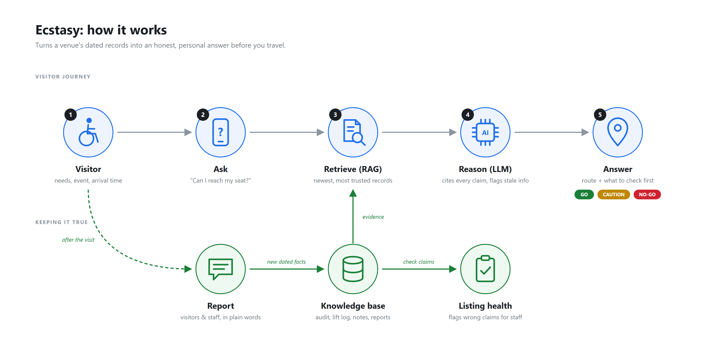
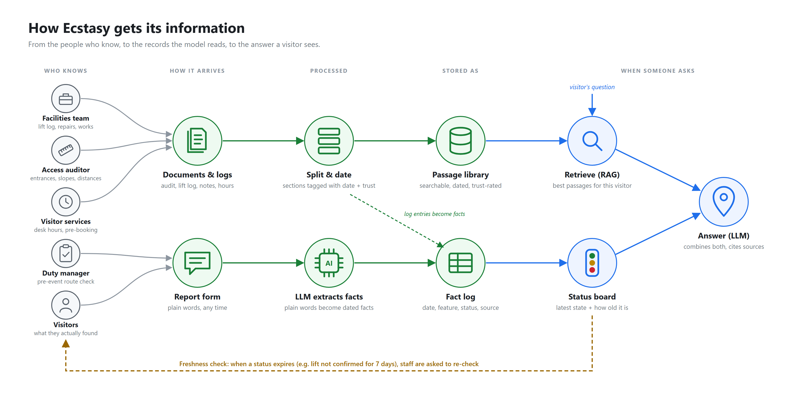
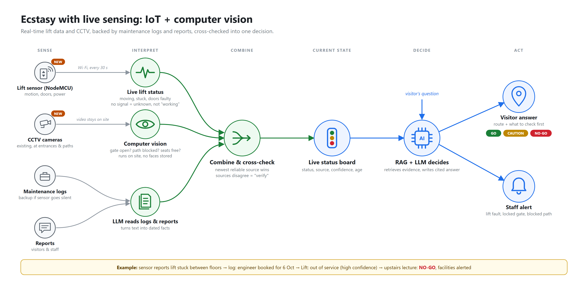

# Solution proposal: Ecstasy

**Accessible until the last staircase**

| | |
|---|---|
| Prepared by | Team hyperbrick |
| Date | 1 October 2026 |
| AI technologies | Retrieval-augmented generation (RAG), large language models (LLMs) |
| Status | Working prototype (Streamlit web app) |

---

## 1. Summary

A venue listing that says "wheelchair accessible" made a promise the building could not keep on the day. The main
entrance had stairs, the only step-free gate was locked, and the lift was out of service. The visitor missed the event
and paid for transport twice. The venue did not know its listing was wrong.

**Ecstasy** replaces the one-word label with a personal, evidence-based answer to the question visitors actually have:

> *"Can I, with my needs, get from arrival to my seat for this visit?"*

It does this by retrieving the venue's own dated records (access audit, lift maintenance log, staff notes, assistance
hours, visitor reports) and using an LLM to write a clear verdict, a step-by-step route, warnings that say how old each
piece of information is, and a checklist of what to confirm before travelling. Every visitor or staff report feeds back
into the records immediately, and venue staff get a "listing health" report that shows which claims are no longer
true and drafts an honest replacement.

---

## 2. What went wrong: scenario analysis

| What happened | Underlying cause |
|---|---|
| "Your website said accessible" | The label is yes/no and undated. Nothing showed it was written in 2024. |
| The main entrance had stairs | The listing describes the building, not the route a visitor must take. |
| The side gate was locked | Access depended on staffed hours, which the listing never mentioned. |
| The lift was out of service | Temporary faults never reach the listing. There is no notion of "last checked". |
| A guard suggested friends carry the visitor | Front-line staff had no contingency plan to offer. |
| Missed event, paid for transport twice | Problems were discovered only on arrival. There was no way to verify before travelling. |
| "We did not know the listing needed changing" | Nothing connects what happens on site back to the listing. Staff are never prompted. |
| Second visitor needs seating and gentle slopes | "Accessible" means different things to different people. One label cannot serve both. |

The pattern: **accessibility information is binary, undated, building-level and one-way**, while accessibility itself
is route-level, time-dependent, personal and constantly changing.

---

## 3. Problem statement

> A venue's "wheelchair accessible" label is a fixed, yes/no promise about something that changes daily and depends on
> the route, the time and the person. Because the label has no date, no route and no feedback loop, it goes out of
> date without anyone noticing, and disabled visitors discover the truth at the last staircase.
>
> **Focused question:** how can a visitor get an honest, personalised and current answer before travelling, and how can
> the venue learn its listing is wrong before a visitor does?

---

## 4. Who we are designing for

- **Wheelchair user** (the complainant). Needs a step-free route end to end: entrance, gate, path width, ramp, lift.
  Needs to know whether someone will open the gate at their arrival time.
- **Visitor who walks short distances** (the second visitor). Needs distances, slope gradients, and where to sit and
  rest along the way and at the destination.
- **Venue staff** (the venue response). Need to know when the listing is wrong, which upcoming events are affected,
  and what to publish instead, without extra admin work.

---

## 5. Proposed solution

Ecstasy has three parts, one for each side of the scenario.

### 5.1 Check before you travel (visitors)

The visitor chooses their event, how they get around, any extra needs (seating, avoiding steep slopes, staff
assistance) and can ask a question in their own words. Ecstasy returns:

- a **verdict**: GO, CAUTION or NO-GO for this visitor and this visit
- a **step-by-step route** from arrival to seat, every step cited to a dated source
- **warnings** that state how fresh the information is, e.g. "lift last confirmed 4 days ago"
- a **verify-before-travel checklist**: who to call, when, and exactly what to ask
- **where the public listing is wrong**, called out explicitly

The arrival time is checked against assistance desk hours, and Ecstasy says whether the 48-hour pre-booking window is
still open.

### 5.2 Report what you found (visitors and staff)

Anyone can describe what they found in plain language. The LLM converts the report into structured, dated facts per
feature (lift, side gate, intercom, ramp, courtyard path, seating and so on). They join the records immediately, so
the next visitor's answer reflects what actually happened rather than what the listing says.

### 5.3 Listing health (venue staff)

Each claim in the public listing is checked against the latest evidence and graded **supported**, **needs
qualifying**, **unverified** or **contradicted**, with the reason and source. The report also flags upcoming events at
risk (for example, an upstairs evening lecture while the lift is down and the desk is closed), lists statuses that
need re-confirming, and drafts an honest, route-level replacement listing ready to publish.

### Design principles

1. **Evidence over labels.** Every statement traces back to a dated record.
2. **Freshness is visible.** Each feature has its own trust window: 7 days for the lift, 60 for the ramp, never
   for a staircase. Older information is flagged, not hidden.
3. **Personal, not generic.** The same venue gets a different answer for a wheelchair user and for someone who needs
   rest stops.
4. **Honest about uncertainty.** "Unconfirmed, call to check" is a valid answer. A confident wrong answer is not.
5. **Never unsafe advice.** Being carried is never offered as a route. If the only way in involves stairs, the
   answer is NO-GO.

---

## 6. System architecture

*Editable source: [`architecture.svg`](architecture.svg)*

### How the information gets in

*Editable source: [`data-flow.svg`](data-flow.svg)*

The people who already know the building feed Ecstasy through the work they already do. Facilities staff keep the lift
log and note repairs and temporary works. The access auditor's report covers entrances, slopes and distances. Visitor
services own desk hours. Duty managers and visitors use the report form. Documents are split into dated, trust-rated
sections. Free-text reports are turned into dated facts by the LLM. When a status passes its freshness window, staff
are prompted to re-check it.

### How a request flows

1. **The visitor asks.** They pick an event and their needs on the *Check before you travel* page.
2. **Visit context is worked out.** Is the destination upstairs (lift needed)? Will the assistance desk be staffed at
   arrival? Is pre-booking still possible?
3. **Relevant evidence is retrieved (RAG).** The retriever searches the venue's document sections and ranks them by
   relevance, how recent they are, and how trustworthy the source is. The public listing always ranks lowest.
4. **The status board is built.** The latest dated fact for each feature, with a flag for anything older than its
   trust window.
5. **The LLM writes the answer.** It receives the visitor profile, visit context, status board and numbered passages,
   and must cite a passage for every claim. Output is fixed-format JSON so the app can display it reliably.
6. **The loop closes.** Reports from the *Report what you found* page are turned into new dated facts, which change
   the next answer and the venue's *Listing health* report.

### Components

| Component | What it does | Prototype implementation |
|---|---|---|
| Web app | Three pages: visitor check, reporting, listing health | Streamlit |
| Knowledge base | Venue documents split into dated sections, each with a source type and trust level | Markdown and JSON files, one folder per venue |
| Dated fact log | One row per observation: date, feature, status, note, source | JSON Lines (seed facts plus live reports) |
| Retriever | Finds the most relevant passages for a question and visitor profile | BM25 keyword search, multiplied by a recency boost and a trust weight |
| Status board | Latest fact per feature, with a per-feature freshness window | Python, computed on each request |
| Visit context | Lift needed? Desk staffed at arrival? Pre-booking still possible? | Python rules over venue configuration |
| LLM | Writes cited answers, extracts facts from reports, drafts listings | Any OpenAI-compatible model (OpenAI, Groq, Ollama) |
| Rule-based fallback | Same pipeline without an API key, for offline demos | Deterministic Python |
| Claim auditor | Grades each listing claim against the status board | Python rules, with the LLM drafting the replacement text |

### Extension: live sensing with IoT and computer vision

*Editable source: [`live-sensing.svg`](live-sensing.svg)*

The biggest weakness of record-based information is delay: a lift can fail minutes before a visitor arrives. Two
new inputs close that gap.

- **Lift sensor (NodeMCU / ESP-class microcontroller).** Reports motion, door faults and power state every 30
  seconds over Wi-Fi. A missing heartbeat is treated as "unknown", never as "working".
- **Computer vision on existing CCTV.** Detects whether the side gate is open, whether the step-free path is blocked
  (scaffolding, deliveries, crowds) and whether seats are free. Video is processed on site and only labels such as
  "gate: closed, 18:31" are stored. No faces or footage leave the building.

**Maintenance logs and reports remain the backup and the context.** If the sensor goes silent, the latest log entry
is used, with its age shown. If sources disagree (the sensor says the lift is moving, the log says it is out of
service), the status becomes "verify" and staff are alerted. Simple deterministic rules combine the signals into the
status board, so safety-relevant states never depend on a model guess. RAG and the LLM then explain that state to
the visitor with citations, and draft the staff alert.

Practical notes for a pilot: a lift car is a metal box, so the sensor may need a gateway at the top of the shaft or a
wired link. Any connection to lift equipment must be installed by the certified lift contractor (reading an existing
fault relay is safer than adding new wiring to the controller). CCTV use must follow the venue's existing privacy
notices and data-protection rules.

---

## 7. Why RAG and LLMs

- **Why not just a better listing form?** The venue already had a form; staff update it "only occasionally". The
  information that matters (lift faults, scaffolding, a locked gate at 18:30) arrives as maintenance notes and
  complaints, not form fields. An LLM can turn that unstructured text into structured facts.
- **Why not a plain chatbot?** An LLM on its own would either invent details or repeat "the venue is accessible". RAG
  grounds every answer in the venue's own dated records and makes each claim checkable through citations.
- **Why recency and trust weighting?** Ordinary retrieval treats a 2024 marketing listing and yesterday's lift fault
  as equally relevant. Ecstasy boosts recent operational reports and ranks marketing copy lowest, so the newest
  reliable evidence wins.
- **Why a status board alongside the passages?** It gives the LLM an explicit "latest known state and age" for each
  feature, so it reasons about freshness instead of guessing from scattered text.

The LLM has three jobs: (1) write the visitor's cited answer, (2) extract facts from free-text reports, and (3) draft
the honest replacement listing.

---

## 8. Responsible AI and safety

| Risk | Mitigation |
|---|---|
| The model invents facilities or hours | Answers must cite numbered passages. The prompt forbids anything not in the evidence. |
| Out-of-date information presented as current | Every feature shows "last confirmed N days ago". Stale items are flagged and turned into a "call to check" step. |
| Unsafe advice (e.g. "get someone to carry you") | Explicitly prohibited in the prompt and in the rule-based logic. A stairs-only route is NO-GO. |
| A false or malicious report flips a status | Reports are stored with their source and date. Extracted facts must use a fixed list of feature names. The roadmap adds corroboration and staff confirmation. |
| Over-reliance on the AI | The answer always ends with a verify-before-travel checklist. The UI shows whether the answer came from the LLM or the rule-based fallback. |
| Privacy | Reports record access needs only if the reporter chooses to. No names or contact details are stored. |
| Accessibility of the tool itself | Native Streamlit widgets with labelled inputs, plain-language copy and no information conveyed by colour alone. A full screen-reader audit is on the roadmap. |

---

## 9. Prototype status

**Built and working:**

- All three pages, running locally (`streamlit run streamlit_app.py`).
- A synthetic venue, "Riverside Hall", modelled on the scenario: 7 source documents (33 passages) and 21 dated facts,
  including the original complaint as a visitor report.
- Retrieval with recency and trust weighting, the status board, visit-time checks and the claim auditor.
- The LLM integration for all three tasks, for any OpenAI-compatible provider, configured through `.env`.
- A rule-based fallback, so the full demo runs offline.

**Verified end to end in the browser** (fallback mode):

| Scenario | Result |
|---|---|
| Wheelchair user, 19:00 lecture on the first floor | **NO-GO**: lift out of service (last confirmed 4 days ago), desk closed at arrival, main entrance has stairs. The listing's "Lift to all floors" and "Step-free access" are flagged as wrong. |
| Visitor who walks short distances, ground-floor fair | **CAUTION**: no lift needed, but 120 m from parking with no seating, a 1:12 ramp with no rest points, and foyer chairs fill up. |
| Staff report "lift repaired" submitted | Status board updates instantly. The first scenario changes to **CAUTION** (pre-book gate assistance). |
| Listing health | "Wheelchair accessible" and "Step-free access" contradicted. 3 upcoming events at risk. Draft listing ready to download. |

**Not yet done:** the live LLM path is implemented but has not been run against a real API key in this environment, so
the prompts will need tuning once one is connected.

---

## 10. Measuring success

| Goal | Metric |
|---|---|
| Fewer wasted journeys | Reports of "turned up and couldn't get in" per 1,000 accessibility-related visits |
| Visitors check before travelling | Share of accessibility visitors who use the pre-travel check |
| The listing stays true | Share of listing claims graded "supported" each week |
| Statuses stay fresh | Median age of the lift status. Target: under 1 day on event days. |
| Faster correction | Time from a problem report to the public listing being updated |
| Trust | Visitor rating of "the information matched what I found" |

---

## 11. Roadmap

**Phase 1: pilot (weeks 1 to 4)**
Connect a production LLM and tune the prompts. Onboard one real venue's audit and maintenance records. Add a one-tap
daily "lift checked" confirmation for staff.

**Phase 2: reliability (months 2 to 3)**
Add dense-embedding retrieval alongside BM25. Require corroboration (or staff confirmation) before a single report
flips a status. Let staff confirm or dispute reports. Alert booked visitors by SMS or email when a feature they depend
on changes status. Support multiple languages and complete a screen-reader audit.

**Phase 3: scale (months 4 to 6)**
Take live lift status from building-management or IoT feeds. Show route-level access information on ticketing and
event pages. Onboard multiple venues with a shared reporting app.

---

## 12. Technology stack

| Layer | Choice |
|---|---|
| Language | Python 3.14 |
| Web app | Streamlit (multi-page, native widgets) |
| Retrieval | `rank-bm25` with custom recency and trust weighting |
| LLM | OpenAI-compatible SDK. Works with OpenAI, Groq or local Ollama models. |
| Storage | Markdown documents and JSON Lines fact logs (swappable for a database) |

Code layout and run instructions are in the project [`README.md`](../README.md).
