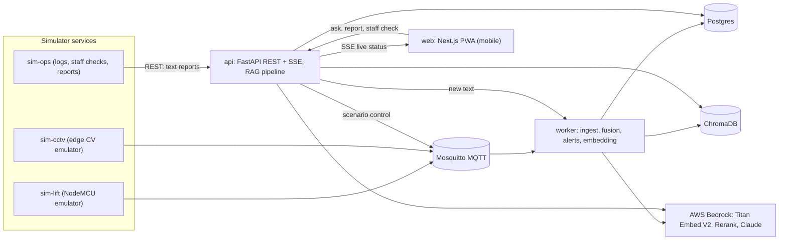
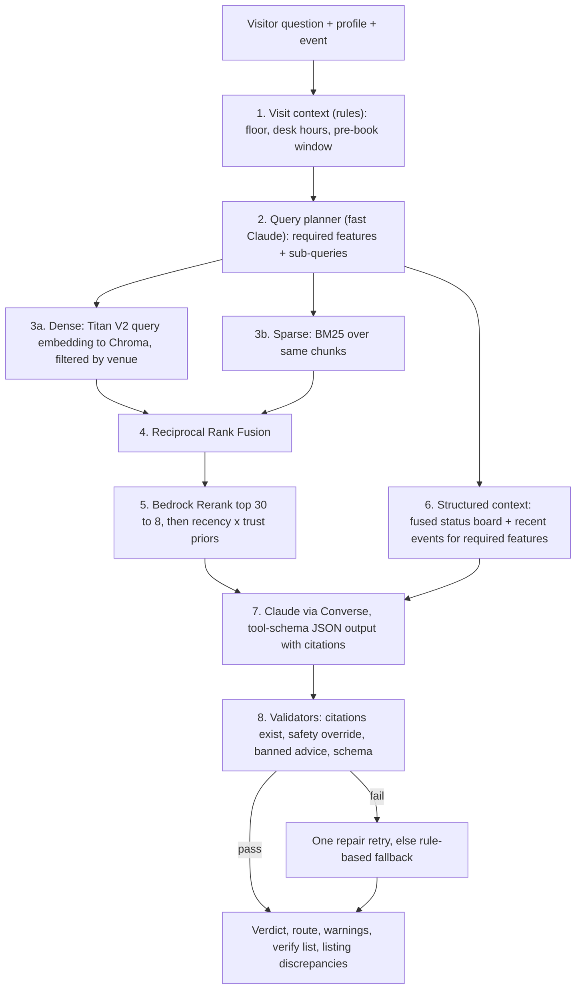

# Nimbus: implementation plan

## 1. Requirements and the decisions they lead to

- **Mobile-first web app** leads to a Next.js (App Router) + Tailwind PWA. It installs on a phone, works with screen readers, and meets WCAG 2.2 AA.
- **No real data, so simulate streams with multiple backends** leads to three simulator services publishing over **MQTT** (Mosquitto). MQTT is the protocol a real NodeMCU would use, so swapping in real hardware later changes nothing downstream.
- **AWS Titan Text Embeddings V2 via boto3, credentials from env** leads to `bedrock-runtime.invoke_model` with `amazon.titan-embed-text-v2:0`, 1024 dimensions, `normalize: true`. Credentials are read from `.env` (`AWS_ACCESS_KEY_ID`, `AWS_SECRET_ACCESS_KEY`, optional `AWS_SESSION_TOKEN`, `AWS_REGION`). The LLM is Claude on Bedrock through the same boto3 session (Converse API). Model IDs are env-configurable.
- **Vector store** leads to **ChromaDB**:
  - It runs in Docker, filters on metadata (venue, source type, trust, date) and stores persistently.
  - The corpus is small per venue (hundreds to thousands of chunks), so OpenSearch Serverless would be costly overkill. pgvector would only be worth it if we needed one database, and Chroma keeps vector concerns isolated.
- **Live sensor data is NOT embedded.** Readings arrive every 30 s and are structured. They go to Postgres and the fusion engine, and their fused state is injected into the prompt as structured context. Only text (documents, logs, reports) goes into the vector store. This split is the core of the RAG design below.
- **Safety-relevant status is decided by rules, explained by the LLM.** This is a deterministic fusion engine plus post-generation validators.

## 2. Runtime architecture



Docker Compose services: `mosquitto`, `postgres`, `chroma`, `worker`, `api`, `web`, `sim-lift`, `sim-cctv`, `sim-ops`.

## 3. The RAG architecture: hybrid, structured-plus-unstructured, verified

Naive RAG (embed the question, take the top-k, generate) fails here for three reasons. Freshness matters more than similarity. The most important fact (is the lift working right now?) is structured live data, not text. And a wrong answer can strand someone. The pipeline:



Key techniques:

- **Contextual chunk headers.** Before embedding, each chunk is prefixed with `venue | document title | section | date | source type`. This improves retrieval for short sections like "Lift".
- **Metadata on every chunk:** `venue_id, doc_id, source_type, trust, date_int (yyyymmdd), feature flags (f_lift, f_side_gate, ...)`. This enables filtered retrieval per required feature.
- **Versioned collections.** The collection name is `chunks_titan_v2_1024`, so a fallback local embedding model never mixes vectors with Titan.
- **Embedding cache.** A `content_hash` to vector table in Postgres means re-ingestion never re-bills Bedrock. Titan V2 takes one input per call, so batches run with a bounded thread pool.
- **Query planner.** It turns "Can I get to the lecture?" for a wheelchair user into features `[lift, side_gate, intercom, courtyard_path, ramp, main_entrance]` and sub-queries per feature. If the LLM is unavailable, a rule-based fallback maps profile to features (reusing `NeedsProfile.query_terms` from [nimbus/pipeline.py](nimbus/pipeline.py)).
- **Rerank.** Uses `bedrock-agent-runtime.rerank` (Amazon Rerank or Cohere Rerank on Bedrock, configurable). If the region lacks it, it falls back to RRF score x recency x trust (the existing logic in [nimbus/retriever.py](nimbus/retriever.py)).
- **Structured generation.** Converse `toolConfig` with a JSON schema of `verdict, headline, summary, route[{text, citations[]}], warnings[], verify[], discrepancies[]`. Live-status items are citable as `S1..Sn` and passages as `P1..Pn`.
- **Validators (deterministic, after generation):**
  - Every cited id must exist, and every route step needs one or more citations.
  - If a required feature is blocking (for example lift `out_of_service` and the destination is upstairs), the verdict is forced to NO-GO.
  - Regex rejection of carry/lift-the-person advice.
  - Stale required features must appear in `verify`.
- **Answer trace.** Every answer stores its retrieved ids, scores, prompt version and latency for evaluation and audit.

## 4. Streaming simulation and fusion

**MQTT topics.** The `+` segments are wildcards for the camera and resource IDs.
- `nimbus/{venue}/lift/{lift_id}/telemetry`: `{floor, moving, door, power, fault_code, ts}` every 30 s, plus a heartbeat.
- `nimbus/{venue}/cctv/{camera_id}/detections`: `{gate_open, path_clear_width_mm, obstruction, seats_free, crowd_level, ts}`. Labels only, never images.
- `nimbus/{venue}/control/scenario`: the demo console sends scenarios to the simulators.

**Simulator scenarios:** `normal`, `lift_stuck`, `lift_door_fault`, `sensor_offline`, `gate_locked_after_hours` (follows desk hours), `scaffolding_narrow`, `seats_full`, `conflict` (sensor says moving, log says out of service). sim-ops posts maintenance log entries, staff checks and plain-language visitor reports to the API on a schedule, and on scenario triggers.

**Fusion engine** (worker, pure Python, unit-tested). A per-feature source table sets priority, TTL and confidence:
- Lift: sensor (TTL 90 s, 0.95), then staff check (24 h, 0.9), then maintenance log (7 d, 0.85), then visitor report (3 d, 0.6).
- Side gate and seating: CCTV (5 min), then staff, then report.
- Courtyard path: CCTV width estimate, then staff note, then report.

Rules:
- The freshest non-expired, highest-priority source wins.
- Non-expired sources that disagree on blocking vs ok produce `verify` plus a staff alert.
- A silent sensor (past its TTL) means fall back to the next source and raise a `sensor_offline` alert. It never assumes the lift is working.

Status changes are written to `feature_status`, pushed over SSE, and trigger "your plan changed" notices to visitors with saved plans.

## 5. Data model (Postgres)

`venues, events, documents, chunks(id, text, meta, content_hash), embedding_cache, observations(feature, status, source_kind, payload, confidence, observed_at), feature_status (fused latest), alerts, reports, staff_checks, answer_traces`.

Seed data comes from the existing corpus in [data/venues/riverside_hall/](data/venues/riverside_hall/). The feature vocabulary and staleness windows are ported from [nimbus/features.py](nimbus/features.py).

## 6. API (FastAPI)

- `GET /api/venues`, `GET /api/venues/{id}`: venue, events, locations, desk hours.
- `POST /api/venues/{id}/ask`, plus `GET .../ask/stream` (SSE progress: "checking live lift sensor", "retrieving records", "writing answer").
- `GET /api/venues/{id}/status` and `GET /api/venues/{id}/stream` (SSE live board and alerts).
- `POST /api/venues/{id}/reports` (LLM fact extraction runs in the worker) and `POST /api/venues/{id}/staff-checks`.
- `GET /api/venues/{id}/listing-health` (claim audit plus a drafted listing, ported from `audit_listing`).
- `GET /api/venues/{id}/alerts`, `POST /api/sim/scenario`, `POST /api/admin/reindex`.

## 7. Mobile web app (Next.js PWA)

Visitor tabs:
- **Plan:** event picker, profile chips, question with voice dictation (Web Speech API).
- **Answer:** verdict card, route stepper, warnings, a verify checklist with tap-to-call, and citation bottom sheets.
- **Live:** feature cards updating over SSE, each showing "updated 12 s ago" and its source icon (sensor, camera, staff, report).
- **Report:** plain text or voice.

Staff tabs:
- **Daily check:** one-tap ticks.
- **Alerts:** live feed.
- **Listing health.**
- **Demo console:** scenario buttons.

Accessibility:
- Tap targets of 44 px or more.
- Status never shown by colour alone.
- `aria-live` for live updates.
- Supports reduced motion and high contrast.
- Offline shell via service worker (Serwist).

## 8. Repository layout

```
apps/web/                 Next.js PWA
services/api/             FastAPI app, RAG pipeline, SSE
services/worker/          MQTT consumer, fusion, alerts, ingestion + embedding
services/sim-lift/  services/sim-cctv/  services/sim-ops/
packages/nimbus_core/     shared: schemas, features, fusion rules, bedrock client, prompts
infra/docker-compose.yml  infra/mosquitto.conf  .env.example
data/venues/...           seed corpus (existing)
eval/                     golden set + runner
```

The existing [nimbus/](nimbus/) and Streamlit app stay in `legacy/` until the new app reaches parity, then are removed. Python 3.12 in containers (avoids the 3.14 wheel gaps).

## 9. Evaluation (proves the answers are right)

`eval/golden.yaml` holds 25+ cases: the complaint scenario, the second visitor, conflicts, sensor offline, after-hours gate, and ground-floor events while the lift is down. `eval/run_eval.py` reports:
- verdict accuracy
- retrieval recall@8 against expected source ids
- citation validity rate
- safety-rule violations (must be 0)
- p95 latency

It runs in both Bedrock mode and fallback mode.

## 10. Anticipated questions (captured in `docs/QA.md`)

- Why hybrid retrieval rather than vectors only? Exact terms ("Mill Lane", "1:12") need BM25, and paraphrases need Titan.
- Why not embed sensor data? It is structured and changes every 30 s. Embedding it would be stale and expensive.
- What if the sensor dies? Its TTL expires, the next source takes over with its age shown, and staff are alerted.
- What if sources disagree? The status becomes `verify`, with no guessing.
- Can the LLM say the lift works when it doesn't? No. Validators override the verdict from the rule-fused status.
- CCTV privacy? Detection runs at the edge and only labels are stored.
- Cost? Embeddings are cached by hash, a fast model handles planning and extraction, and the larger model handles answers only.
- Scale? Stateless API, one Chroma collection per embedding version, and venues are just metadata.
- Without AWS keys? An automatic local fallback, clearly labelled in the UI.
- Is the app itself accessible? WCAG 2.2 AA checklist plus screen-reader testing.

## 11. Delivery phases

1. Infra and shared core.
2. Simulators.
3. Worker fusion.
4. Ingestion and embeddings.
5. RAG pipeline.
6. API.
7. PWA.
8. Eval and docs, with an implementation architecture diagram in the existing minimalist style.
9. End-to-end demo script (complaint scenario live: trigger `lift_stuck`, then watch the visitor's answer flip to NO-GO and a staff alert fire).